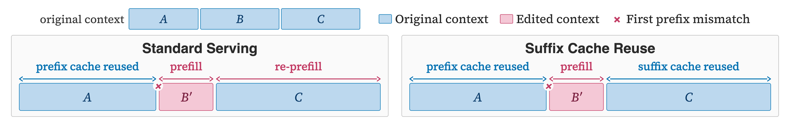
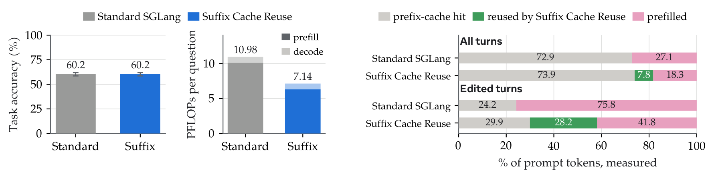
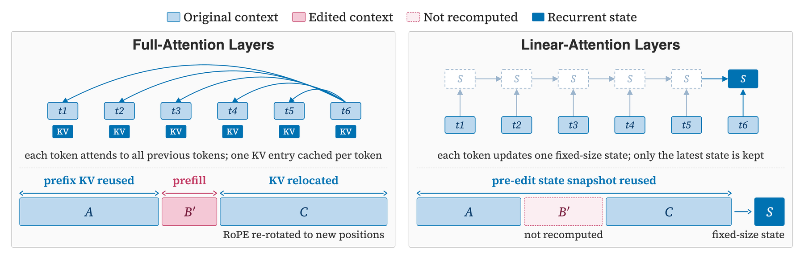
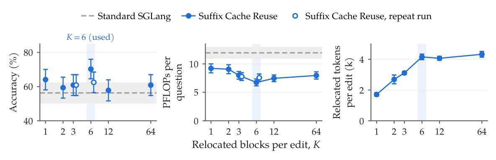
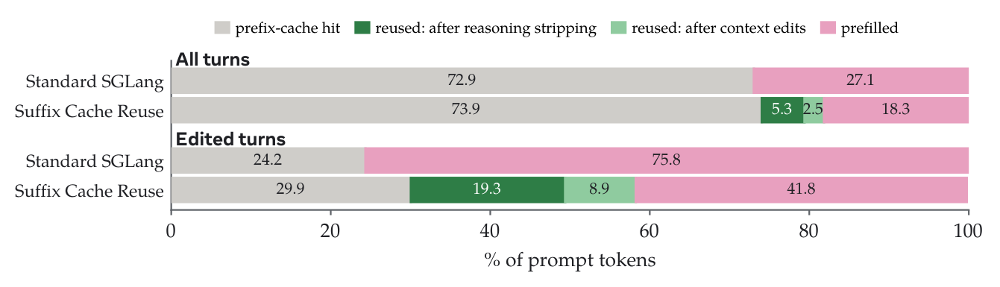
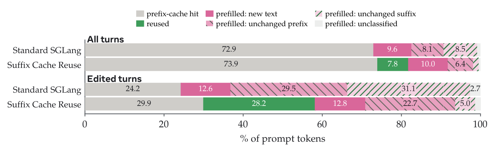

# Suffix Cache Reuse

**Efficient CLM serving: reuse the KV cache of text that survives a context edit, as a patch to SGLang.**

A CLM edits its own context, so the prompt changes in the middle rather than only at the
end. Standard prefix-cache reuse must then re-prefill every token after the first mismatch.
Suffix Cache Reuse (SCR) removes most of this re-prefilling. When a span B is replaced by B′
after an edit, SCR reuses the cached states of all surviving tokens, including C, and only
reprefills the newly inserted or appended tokens B′. Surviving suffix tokens C thus retain
stale cache states that encode the previous prefix, which can even be beneficial in some
cases, as it retains richer information from the past. By contrast, standard prefix-cache
reuse must re-prefill all tokens after the first mismatch (B′ and C).

<p align="center"></p>
<p align="center"><em>Standard serving reuses only prefix-matched cache, while SCR reuses cached states for all surviving tokens, reducing re-prefilling.</em></p>

## Results

SCR effectively reduces cache re-prefilling, matching the standard SGLang serving with
65.0% of its empirical prefix-reuse FLOPs on BrowseComp-Plus (BCP). SCR is not limited to
CLMs: serving engines commonly strip prior reasoning tokens from chat histories, causing
subsequent preserved tokens to be re-prefilled, and SCR also reduces this re-prefilling cost.

<p align="center"></p>
<p align="center"><em>SCR and standard SGLang serving on BCP with Qwen3.6-27B. Left: task accuracy and
prefix-reuse FLOPs per question. Right: server-side compute decomposition, showing the fraction
of prompt tokens by compute type across all turns and turns following context edits.</em></p>

## How it works

**Background: the radix tree in SGLang.** SGLang keeps the KV cache of served requests in a
radix tree over token sequences. A new request walks the tree to its longest matching prefix,
reuses the KV entries along that path, and prefills only the remaining tokens, so reuse stops
at the first mismatched token. After an in-the-middle edit, every token after the edit is
re-prefilled, including text that survived unchanged. SCR keeps this tree as is and extends
reuse to the surviving tokens beyond the matched prefix.

<p align="center"></p>
<p align="center"><em>Suffix Cache Reuse for full-attention layers (left) and linear-attention layers (right).</em></p>

**Full-attention layers.** Consider a context `[A B C]` in which an edit replaces B with B′.
Standard serving matches only A and re-prefills B′ and C. When a new prompt arrives, SCR
diffs it against the session's previous prompt to find the spans that survived the edit, and
relocates up to K of them, largest first (K=6 by default). For each relocated span such as C,
it reuses the cached keys and values, re-rotates the keys' rotary position encodings to their
new positions, and splices them in after B′. Only B′ and newly appended tokens are prefilled.
Relocated entries live in session-private cache slots, so the shared radix tree never holds a
moved entry; if these slots cannot be allocated, the server falls back to standard
re-prefilling.

**Linear-attention layers.** In hybrid models such as Qwen3.6-27B (48 of 64 layers use
linear attention), linear-attention layers maintain a fixed-size recurrent state rather than
per-token caches, so there are no token-level entries to relocate. For these layers, SCR
snapshots the recurrent state before the edit and continues from that snapshot, while the
edit is reflected in the 16 full-attention layers that retain token-level context. B′ is
still recomputed in the full-attention layers and can influence later linear-attention layers
through their inputs.

**Multiple surviving spans.** A single edit may leave multiple surviving spans after the edit
point. SCR caps the number of relocated spans per edit at K, reusing the K longest spans and
re-prefilling the rest. This bounds the amount of approximation introduced at once. On 64 BCP
questions with Qwen3.6-27B, performance is robust across K, while cache-reuse gains largely
saturate by K=6.

<p align="center"></p>
<p align="center"><em>Relocated spans per edit, K, on 64 BCP questions with Qwen3.6-27B. Left: task accuracy.
Middle: prefix-reuse PFLOPs per question. Right: relocated tokens per edited request. Dashed
lines show standard SGLang; the shaded column marks K=6.</em></p>

**Bonus: stripped reasoning tokens.** Chat templates for reasoning models, including Qwen3.6,
often remove the reasoning block from earlier assistant turns once the next user message
arrives. Standard serving then re-prefills all preserved text after the first removed block,
even when the agent never edits its own context. SCR treats reasoning stripping as another
context edit and reuses the cached states of the preserved text. On BCP, of the 7.8% of all
prompt tokens reused by SCR beyond prefix-cache hits, 5.3 points come from reasoning
stripping and 2.5 from other context edits.

<p align="center"></p>
<p align="center"><em>SCR reuses cached states after model-driven context edits and after reasoning tokens are
stripped from prior turns. Qwen3.6-27B on 830 BCP questions, K=6.</em></p>

**Future improvement space.** SCR removes most re-prefilling of unchanged suffix tokens
after an edit. Much of the remaining redundant prefill instead comes from unchanged prefixes
that standard prefix caching should ideally reuse. Linear-attention layers maintain recurrent
states, which SGLang stores only at cached request boundaries; when a later prompt diverges
inside a cached span, no recurrent state is available near the branch point, so cache
matching can fall back to a much shorter prefix. This affects both standard prefix caching
and the efficiency attainable with SCR. Storing recurrent states at finer-grained locations,
such as message boundaries, is therefore a promising direction for improving both.

<p align="center"></p>
<p align="center"><em>Remaining re-prefill under SCR on BCP. SCR removes most re-prefilling of unchanged suffix
tokens, while unchanged-prefix prefill remains due to the current hybrid-model caching
behavior in SGLang. Same runs as the figure above.</em></p>

## Implementation

SCR is a monkeypatch applied at start-up to an installed SGLang
([`suffix_cache_reuse/overlay.py`](suffix_cache_reuse/overlay.py)); no SGLang source file is
modified. Per request:

```
previous prompt   [ A ][ B ][ C1 ][ x ][ C2 ][ ... ]
new prompt        [ A ][ B'][ C1 ][ C2 ][ ... ][ D ]
                   radix  |    |     |
                   cache  |  relocated spans (re-rotated K/V from the side buffer)
                        prefilled: B', the last few tokens of each span, D
```

| step | what the code does | setting |
|---|---|---|
| session match | attaches the request to the tracked conversation with the same `cache_salt`, the longest common prefix (at least 1024 tokens) and high token overlap; no session header needed | `KVREUSE_MAX_SESSIONS` |
| session-private slots | keeps each conversation's previous-turn K/V in a separate GPU side buffer | `KVREUSE_SIDE_SESSIONS`, `KVREUSE_SIDE_TOKENS` |
| diff and relocate | diffs the new prompt against the previous one and relocates the K longest surviving spans: copies their K/V into fresh KV-cache slots, re-rotates RoPE keys, and splices them into the request's prefix | `KVREUSE_MAX_BLOCKS` (K) |
| span tail | prefills the last few tokens of each span instead of relocating them | `KVREUSE_V6_MIN_EXTEND` |
| linear attention | restores the recurrent state saved at the end of the previous prompt when splicing the first span | `KVREUSE_SSM_MODE=fork` |
| fallback | serves the request with standard prefix caching when no plan applies or slots cannot be allocated; a request whose A came from the radix cache keeps its own recurrent state | — |

## Install

```bash
pip install sglang==0.5.16          # the SGLang version SCR is built for
git clone https://github.com/facebookresearch/context-language-models.git
cd context-language-models/suffix_cache_reuse
pip install -e .
```

## Run

```bash
bash examples/serve_qwen36.sh                        # Qwen3.6-27B, one GPU, SCR on
KVREUSE_ENABLED=0 bash examples/serve_qwen36.sh      # the same server with SCR off
```

The example is a thin wrapper around

```bash
python -m suffix_cache_reuse.serve --model-path Qwen/Qwen3.6-27B [any sglang.launch_server args]
```

`suffix_cache_reuse.serve` fills in the SCR environment defaults, puts
`suffix_cache_reuse/_site` (a `sitecustomize.py`) on `PYTHONPATH` so that every
SGLang process loads the patch, and then runs `python -m sglang.launch_server` with
your arguments. It adds `--log-requests --log-requests-level 0` if `--log-requests`
is not given; level 0 logs request metadata only (ids and token counts, no text),
which is what the analysis script reads.

The server prints one start-up line per scheduler process:

```
[kvreuse-site] ... max_blocks=6 mb_min_gap=0 splice_retry=8
```

and one line per relocated block:

```
[kvreuse] v6 splice OK: rid=<rid> sid=<session> slot=<n> A+B'=<prefix> C'=<relocated> extend=<n> live=<n> [...] blocks=<i>/<K>
```

## Configuration

All settings are environment variables read at server start. The defaults below
(`suffix_cache_reuse/config.py`) are the K=6 setting; a variable that is already
set in the environment takes precedence.

| variable | default | meaning |
|---|---|---|
| `KVREUSE_ENABLED` | `1` | `0` starts plain SGLang (nothing is patched) |
| `KVREUSE_MAX_BLOCKS` | `6` | K, the number of unchanged blocks relocated per request |
| `KVREUSE_SPLICE_RETRY` | `8` | scheduling rounds a ready plan waits for SGLang's chunked-prefill slot |
| `KVREUSE_SSM_MODE` | `fork` | recurrent-state handling for linear-attention layers (`fork`, `strict`, `none`) |
| `KVREUSE_V6_MIN_EXTEND` | `16` | tokens at the end of each block that are prefilled rather than relocated |
| `KVREUSE_SIDE_SESSIONS` | `12` | conversations held in the side buffer; set it to at least the number of concurrent conversations |
| `KVREUSE_SIDE_TOKENS` | `30000` | tokens held per conversation |
| `KVREUSE_MAX_SESSIONS` | `16` | conversations tracked for session matching (LRU) |
| `KVREUSE_TRACE` | `1` | one `kv6trace ev=req` line per request (session id, previous prompt length, and the first 48 prompt tokens as a tag) |
| `KVREUSE_DEBUG` | `1` | per-request planning lines |

The side buffer is a separate GPU allocation of `SIDE_SESSIONS x SIDE_TOKENS`
tokens of full-attention K/V; the server logs its size at the first request
(`side buffer: 12 slots x 30000 tokens (21.97 GiB, 64.0 KiB/token)` for
Qwen3.6-27B at the defaults). Leave room for it with `--mem-fraction-static` (the
example uses 0.75).

## Analysis

```bash
python -m suffix_cache_reuse.serve ... > server.log 2>&1
python analysis/scr_report.py server.log --csv requests.csv --json summary.json [--num-tasks N]
```

Every prompt token is served in exactly one of three ways, and the script reports
all three per request:

```
prompt_tokens = radix_matched + relocated + forwarded
```

| column | source |
|---|---|
| `rid`, `prompt_tokens`, `decode` | SGLang's `Finish:` line (`id`, `prompt_tokens`, `completion_tokens`) |
| `relocated`, `blocks` | sum of `C'` over the request's `v6 splice OK` lines, and their count |
| `radix_matched` | `cached_tokens - 2 x relocated` |
| `forwarded` | `prompt_tokens - radix_matched - relocated`, the tokens the model ran |
| `session`, `prev_prompt_tokens`, `class` | the `kv6trace ev=req` line; `class` is `edited` when the radix match stops more than 64 tokens short of the previous prompt, `append` otherwise, `first` for a new conversation |
| `prefix_reuse_pflops` | `2 x N_body x (forwarded + decode) / 1e15` |

On a request with relocated blocks SGLang's `cached_tokens` counts the relocated
rows twice (through the scheduler's prefix length and through SCR's own increment
when it splices a block), so the radix match is `cached_tokens - 2 x relocated`.

The summary gives the relocated share of prompt tokens and of non-radix tokens and
the prefix-reuse PFLOPs in total, per request and, with `--num-tasks`, per task.
`N_body` is the non-embedding parameter count (`--n-body-params`, default
24.3532e9 for Qwen3.6-27B). The script re-derives the token identity for every
request and the PFLOPs total two ways, and exits with status 2 if a check fails.
It reads logs from servers with SCR on or off, so the same command gives the
comparison row for plain SGLang.

## Using SCR with an agent

Point the agent's OpenAI-compatible client at the server
(`http://<host>:30000/v1`, model `qwen36-27b` in the example). The CLM agent and
other harnesses need no changes:

- **No session header is needed.** SCR attaches each request to its conversation
  by content: the tracked conversation with the longest common prefix (at least
  1024 tokens) and a high overall token overlap.
- **Request ids (optional).** To join server-side numbers with client-side logs,
  send a unique `rid` in the request body (`extra_body={"rid": "<conversation>-<turn>"}`
  with the OpenAI client). SGLang echoes it as the request id in the `Finish:` line
  and SCR uses it in its own log lines; it has no effect on scheduling or caching.
- **Per-request switch (optional).** `extra_body={"cache_salt": "kvreuse:off"}`
  serves that request as plain SGLang. `cache_salt` is also part of SGLang's radix
  cache key, so use it for whole conversations.
- **Isolation.** Like SGLang's radix cache, SCR keys conversations by `cache_salt`:
  requests with different salts never share relocated K/V or recurrent state.

## Supported versions and models

- SGLang 0.5.16.
- Qwen3.6-27B (hybrid GatedDeltaNet + full attention) with `KVREUSE_SSM_MODE=fork`,
  on one GPU (`--tp-size 1`), with the server arguments in
  `examples/serve_qwen36.sh`.

## Tests

```bash
python tests/unit_test.py                                   # CPU only, no server
python tests/smoke.py --port 30000                          # server with SCR on or off
python tests/regression.py --port 30000 --log server.log    # server with SCR on
python analysis/scr_report.py server.log
```

- `tests/unit_test.py` checks session matching by `cache_salt` and the recurrent state
  chosen when a planned relocation falls back to normal prefill.
- `tests/smoke.py` sends one three-turn conversation whose later turns delete sections
  from the middle of the first user message. With SCR on, the report shows relocated
  tokens on turns 2 and 3; with SCR off the same requests are served by the radix cache
  and prefill.
- `tests/regression.py` runs short conversations of the same shape and checks the server
  log: a turn under another `cache_salt` reuses nothing from the original conversation,
  a turn that finishes on its first token leaves no saved state for the next turn to
  reuse, and an ordinary conversation is relocated as usual.

## License

See the repository [LICENSE](../LICENSE).
